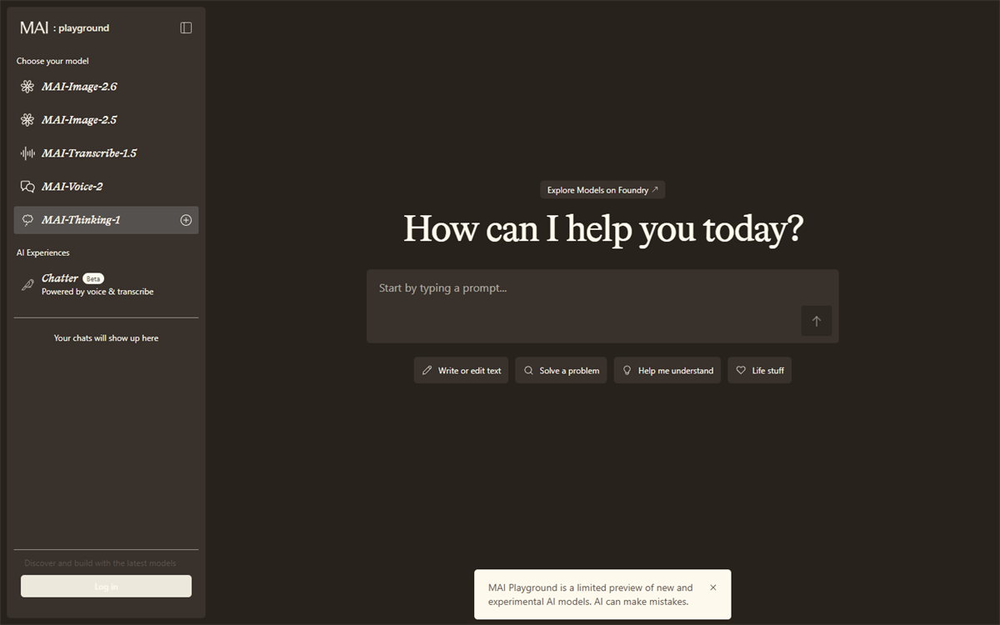
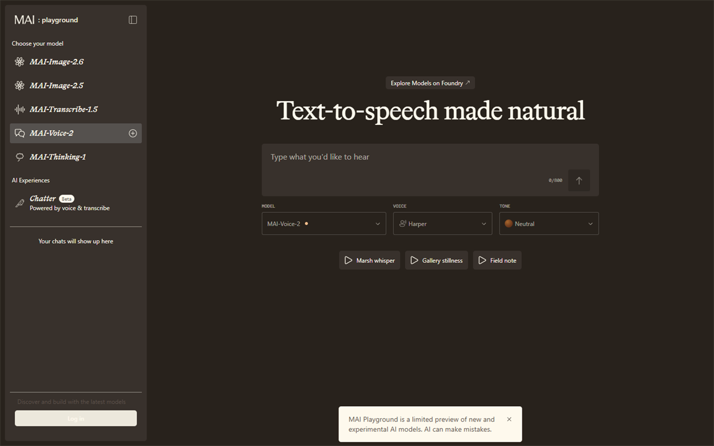
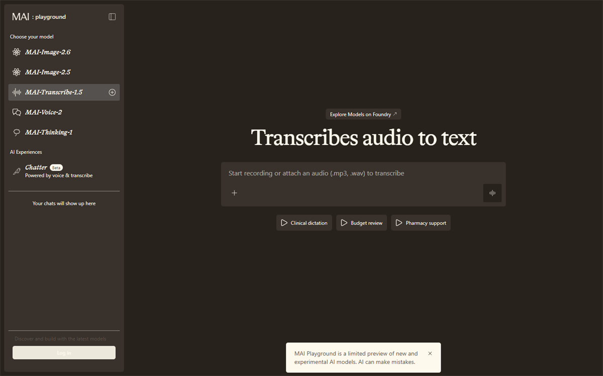
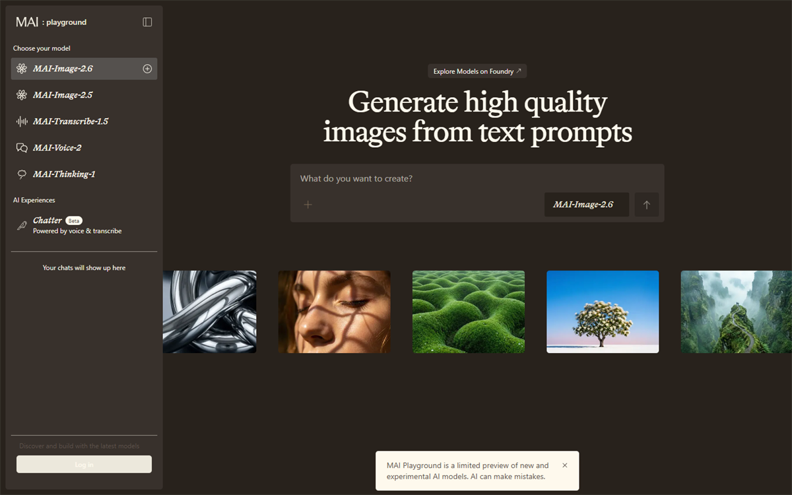

---
lab:
  title: Explore Microsoft AI models
  description: Explore reasoning, speech, transcription, and image generation models in the MAI Playground.
  duration: 30 minutes
  level: 100
  islab: true
  status: released
  primarytopics:
    - Microsoft AI models
---

# Explore Microsoft AI models

In this exercise, you'll use the [MAI Playground](https://playground.microsoft.ai/){:target="_blank"} to explore Microsoft AI models that can reason, generate speech, transcribe audio, and create images.

Imagine that you work for **Fabrikam Fresh**, a neighborhood grocery business that is launching **FreshBox**, a weekly meal-kit subscription featuring locally sourced ingredients. The launch team needs a campaign plan, an audio advertisement, an accurate transcript, and a promotional image. You'll use a different model for each part of the campaign and carry ideas from one activity into the next.

By the end of this exercise, you'll have:

- Used a reasoning model to compare launch options and recommend a campaign plan.
- Generated a spoken advertisement and transcribed it back into text.
- Created and refined a promotional image based on the campaign plan.

This exercise should take approximately **30** minutes to complete.

> **Important**: The MAI Playground is a limited preview of new and experimental AI models. The available controls may change, and the output you see may differ from the examples described in this exercise. AI-generated content can contain errors, so review all output before using it.

## Before you start

To complete this exercise, you need:

- A modern web browser with audio playback enabled.
- A Microsoft account that you can use to sign in if prompted.
- Permission to download and upload an audio file on your computer.

Open the [MAI Playground](https://playground.microsoft.ai/){:target="_blank"} at `https://playground.microsoft.ai/`. If prompted, sign in, and then review the available models. You should see the models used in this exercise: **MAI-Thinking-1**, **MAI-Voice-2**, **MAI-Transcribe-1.5**, and **MAI-Image-2.6**.

> **Note**: Do not enter confidential, personal, or proprietary information in the playground. The Fabrikam Fresh scenario and all of the information in this exercise are fictional.

## Chat with a reasoning model

A reasoning model is designed to work through complex problems that involve constraints, trade-offs, and multiple possible solutions. In this section, you'll ask **MAI-Thinking-1** to recommend a launch strategy for FreshBox.

1. In the MAI Playground, select **MAI-Thinking-1**.

	

1. Start a new conversation and enter the following prompt:

	```prompt
	You are advising Fabrikam Fresh, a neighborhood grocery business that is launching FreshBox, a weekly meal-kit subscription featuring locally sourced ingredients.

	The launch budget is $20,000. The campaign must run for four weeks and reach busy professionals and families within 10 miles of the store. The team is considering three options:
	- A weekend tasting event at the store
	- Paid social media advertising
	- Partnerships with local gyms and community organizations

	Compare the options using these criteria: likely reach, cost, speed to launch, ability to build trust, and operational effort. State any assumptions you make. Recommend how to divide the budget across one or more options, explain your reasoning, and finish with a four-week action plan in a table.
	```

1. Review the response. Look for the assumptions the model made, how it compared the trade-offs, and whether the recommendation respects the budget, audience, location, and schedule.

	> **Note**: A confident or detailed answer is not necessarily correct. Check the arithmetic and identify any claims that would need evidence, such as estimated advertising costs or audience reach.

1. Test how the model adapts when a constraint changes by entering this follow-up prompt:

	```prompt
	New information: only two employees are available to support the launch, and together they can spend no more than 20 hours per week on campaign activities. Revise your recommendation and action plan. Clearly identify what changed and why.
	```

1. Compare the revised answer with the original. Consider the following questions:

	- Did the model reduce activities that require significant staff time?
	- Did it preserve the strongest parts of the original strategy?
	- Are the revised budget and weekly workload plausible?

1. Ask the model to turn its recommendation into a creative brief that you can reuse in the speech and image sections:

	```prompt
	Based on the revised plan, create a concise creative brief for the FreshBox launch. Include the target audience, customer benefit, three key messages, a call to action, and a visual direction. Do not invent prices or discounts. Keep the brief under 200 words.
	```

1. Keep the response available in your browser, or copy it to a temporary document. You'll use its key messages and visual direction in later sections.

## Use speech models

Speech models can generate natural-sounding audio from text and convert spoken audio into written text. In this section, you'll use **MAI-Voice-2** to create an advertisement based on the launch brief. You'll then use **MAI-Transcribe-1.5** to produce a transcript and check how well the message survived the round trip from text to speech and back to text.

### Generate an audio advertisement

1. In the MAI Playground, select **MAI-Voice-2**.

	

1. Use the following text as the basis for the speech. If the creative brief from the previous section suggests a different key message or call to action, adapt the text while keeping it between 50 and 70 words.

	```text
	Meet FreshBox from Fabrikam Fresh: a simple way to put locally sourced meals on your table, even on your busiest days. Each weekly meal kit brings together fresh ingredients and easy-to-follow recipes for professionals and families in our community. Spend less time planning dinner and more time enjoying it. Visit Fabrikam Fresh to learn about FreshBox and get ready for launch week.
	```

1. If voice or style controls are available, choose a voice and delivery style appropriate for a warm, trustworthy local-business advertisement. Generate the audio and listen to the complete result.

1. Evaluate the generated speech:

	- Is every word understandable?
	- Does the pacing fit a short advertisement?
	- Does the emphasis reinforce the main benefit and call to action?
	- Does the voice sound appropriate for the audience defined in the creative brief?

1. Refine the input text or available voice settings and generate the speech again. For example, shorten a long sentence, add punctuation to create pauses, or replace a word that is pronounced unclearly.

1. Download the version you prefer and save it as **freshbox-ad** using the audio format provided by the playground.

	> **Tip**: If the preview does not provide a download option, use a short audio recording of yourself reading the advertisement for the transcription activity. Avoid including personal information in the recording.

### Transcribe the advertisement

1. In the MAI Playground, select **MAI-Transcribe-1.5**.

	

1. Upload the **freshbox-ad** audio file you created. Start the transcription and wait for the model to process the audio.

1. Compare the generated transcript with the advertisement text. Look closely at:

	- The product and company names, **FreshBox** and **Fabrikam Fresh**.
	- Punctuation and sentence boundaries.
	- Words that were emphasized, spoken quickly, or separated by pauses.
	- Any words you changed while refining the generated speech.

1. Record at least one difference between the source text and the transcript. If the transcript is exact, identify one part of the audio that you expected might be difficult to transcribe and explain why.

1. If you found a transcription error, return to **MAI-Voice-2** and generate another version that might be easier to transcribe. You could slow the delivery, add punctuation around a product name, or simplify the affected sentence. Transcribe the new version and compare the results.

	> **Important**: Speech generation and transcription can mispronounce or misinterpret names, numbers, accents, and specialist terms. In a real campaign, a person should review both the audio and transcript before publication. Always obtain consent before recording or transcribing another person.

## Generate images

Image generation models create visual content from natural-language descriptions. In this section, you'll use **MAI-Image-2.6** to develop campaign artwork that follows the FreshBox creative brief.

1. In the MAI Playground, select **MAI-Image-2.6**.

	

1. Enter the following prompt. Replace the text in brackets with details from the creative brief generated by **MAI-Thinking-1**.

	```prompt
	Create a polished promotional photograph for FreshBox, a weekly meal-kit subscription from a friendly neighborhood grocery business. Show an open recyclable meal-kit box on a bright kitchen counter, filled with colorful locally sourced vegetables, herbs, and neatly packed ingredients. In the background, a busy parent and a young professional prepare a healthy dinner together. The mood is [visual direction from the creative brief]. Natural late-afternoon light, authentic food photography, realistic textures, inviting but not luxurious, diverse community, landscape composition with clear uncluttered space on the left for campaign text. Do not include words, logos, prices, watermarks, or branded packaging.
	```

1. Generate the image and review the result against the creative brief. Check whether:

	- The meal kit and locally sourced ingredients are the main focus.
	- The people, setting, and mood suit the target audience.
	- The image has usable empty space for text.
	- The image contains distorted objects, unwanted text, misleading details, or other visual artifacts.

1. Refine one aspect of the prompt and generate another version. Be specific about the change you want. For example, you could change the camera angle, simplify the background, make the produce more prominent, or request more empty space for a headline.

1. Compare the two images and choose the one that best supports the campaign. Consider how changing one prompt detail affected the composition, mood, and usefulness of the image.

1. Optionally, download your preferred image. Before using an AI-generated image in a real campaign, check it for accuracy, bias, appropriate representation, and compliance with your organization's policies.

## Challenge

Now that you've tried each model separately, create a second FreshBox campaign asset for a different channel, such as a social media post, an in-store display, or a short event announcement.

Use **MAI-Thinking-1** to adapt the message for the channel, **MAI-Voice-2** or **MAI-Transcribe-1.5** if the asset includes audio, and **MAI-Image-2.6** to create a suitable visual. Keep the target audience, customer benefit, and call to action consistent across the assets.

## Summary

In this exercise, you used **MAI-Thinking-1** to reason about a campaign with budget, schedule, audience, and staffing constraints. You then used **MAI-Voice-2** and **MAI-Transcribe-1.5** to create and verify a spoken advertisement, and **MAI-Image-2.6** to generate and refine promotional artwork. Together, these activities showed how specialized models can contribute different capabilities to a single business workflow, and why human review remains essential at every stage.
