---
lab:
  title: Explore Microsoft AI models in Microsoft Foundry
  description: Deploy and test MAI models in Foundry.
  duration: 30 minutes
  level: 200
  islab: true
  status: released
  primarytopics:
    - Microsoft AI models
---

# Use Microsoft AI models in Microsoft Foundry

In this lab, you'll deploy Microsoft AI models in a Foundry project.

This lab should take approximately **35** minutes to complete.

> **Note**: Many components of Microsoft Foundry, including the Microsoft Foundry portal, are subject to continual development. This reflects the fast-moving nature of artificial intelligence technology. Some elements of your user experience may differ from the images and descriptions in this exercise!

## Create a Microsoft Foundry project

Microsoft Foundry uses *projects* to organize models, resources, data, and other assets used to develop an AI solution.

1. In a web browser, open [Microsoft Foundry](https://ai.azure.com){:target="_blank"} at `https://ai.azure.com` and start building; signing in using your Azure credentials. Close any tips or quick start panes that are opened the first time you sign in, and if necessary use the **Foundry** logo at the top left to navigate to the home page.
1. If it isn't already enabled, in the tool bar the top of the page, enable the **New Foundry** option.
1. If you do not have any existing projects, you will be prompted to create one. Create a new project with a unique name; expanding the  **Advanced options** area to specify the following settings for your project (or you can select an existing project if you have one!):
    - **Foundry resource**: *A valid name for your Foundry resource.*
    - **Subscription**: *Your Azure subscription*
    - **Resource group**: *Create or select a resource group*
    - **Region**: Select any of the following regions (which are supported for all MAI models at the time of writing):
        - East US
        - West Central US
        - West US

    > **Tip**: Depending on your permissions in the Azure subscription, you may need to clear the option to set up recommended resources.

1. Wait for your project to be created. It may take a few minutes. Then close any welcome dialogs that are displayed.

    After creating or selecting a project in the new Foundry portal, it should open in a page similar to the following image:

    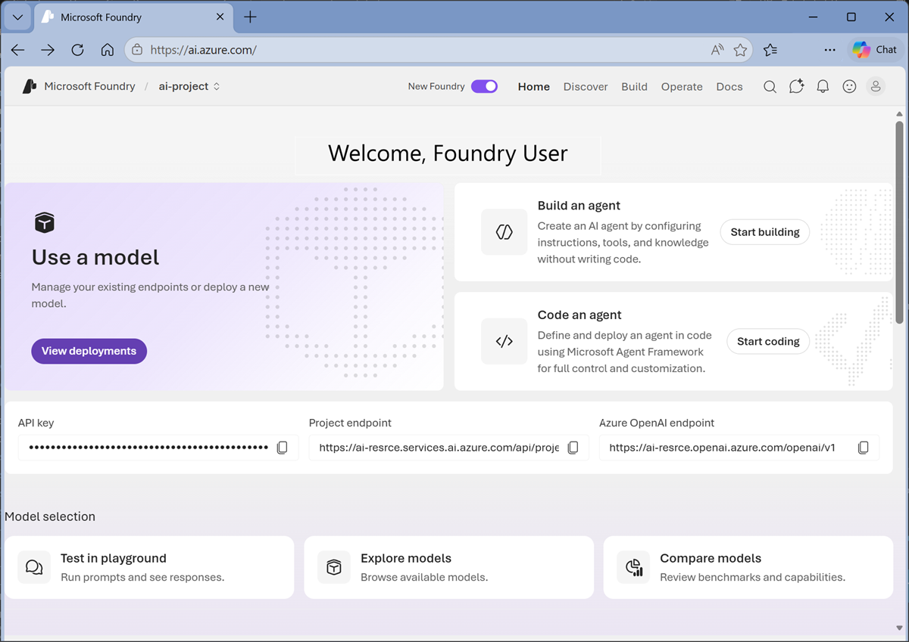

## Deploy and test an *MAI-Thinking* model

Microsoft AI *MAI-Thinking* is a frontier large language model with reasoning capabilities. Ideal for implementing comprehensive AI apps and agents that can reason over contextual information and generate natural language responses.

1. Now you're ready to explore models. On the **Discover** page, select the **Models** tab to view the Microsoft Foundry model catalog.

    Microsoft Foundry provides a large collection of models from Microsoft, OpenAI, and other providers, that you can use in your AI apps and agents.

    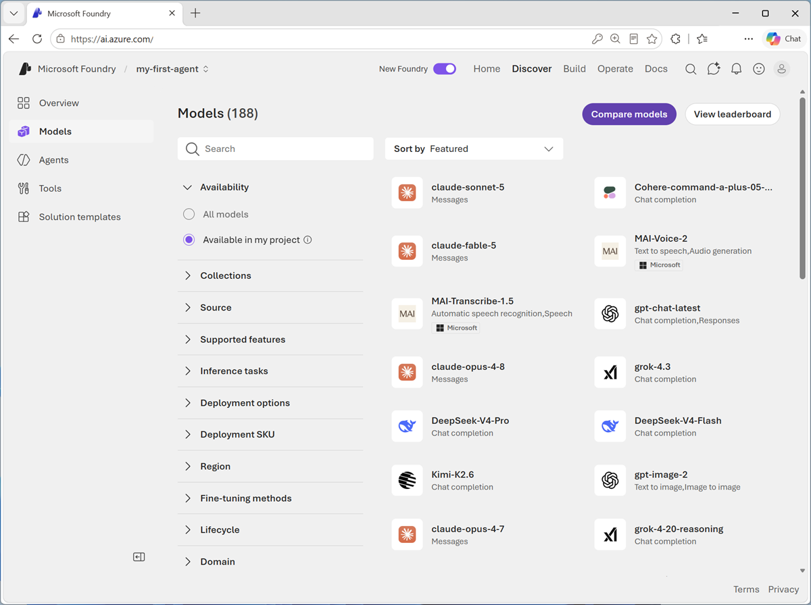

1. Search for `MAI-Thinking` and select the latest available *MAI-Thinking-x* model, and view the page for this model, which describes its features and capabilities.

    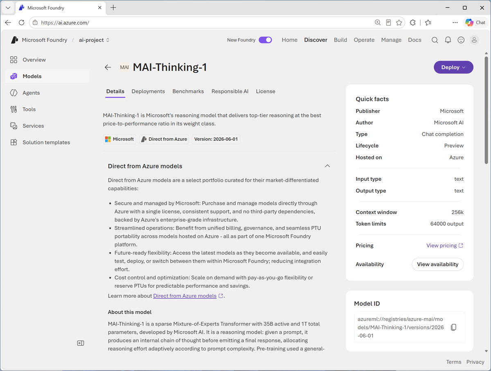

1. Use the **Deploy** button to deploy the model using the default settings. Deployment may take a minute or so.

    > **Tip**: Model deployments are subject to quotas. If you don't have enough quota to deploy an *MAI-Thinking* model, you can request additional quota in the **Quotas** page in FOundry portal. Requesting additional quota does not guarantee it will be granted.

1. When the model has been deployed, view the model playground page that is opened, in which you can chat with the model.

    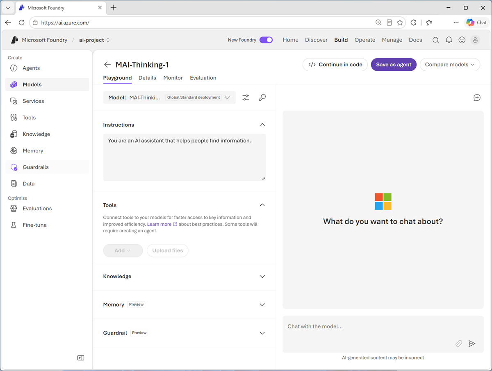

1. In the pane on the left, in the **Instructions** text area, change the system prompt to:

    ```
   You are an expert in the history of computing and AI. You only answer questions about significant people and events in the development of computing, and about notable vintage computers. Do not engage in conversations on any topic that is unrelated to computing history.
    ```

1. In the **Chat** pane, enter the prompt `Tell me about ELIZA.` and view the response.

    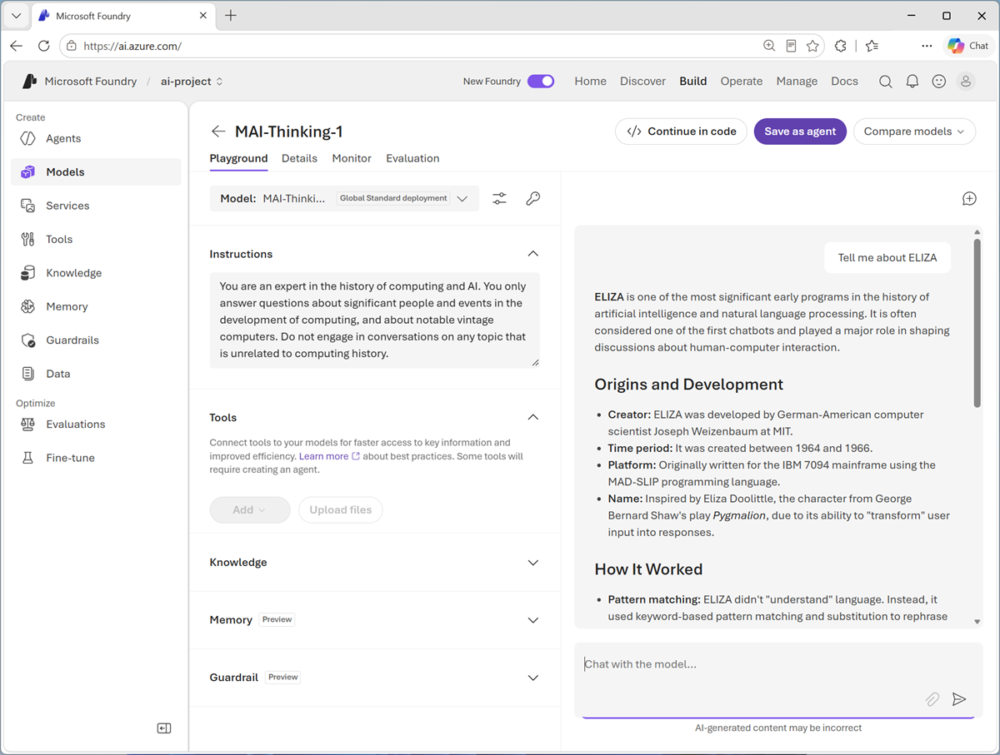

1. Continue the conversation with prompts such as `How does it compare with modern LLMs?`.

## Deploy and test an *MAI-Image* model

Microsoft AI *MAI-Image* is a model family can generate and edit images based on descriptive prompts.

1. In the Foundry portal, on the **Discover** page, select the **Models** page and search for `MAI-Image`. Then select any of the available *MAI-Image-x* models and view its information card.

    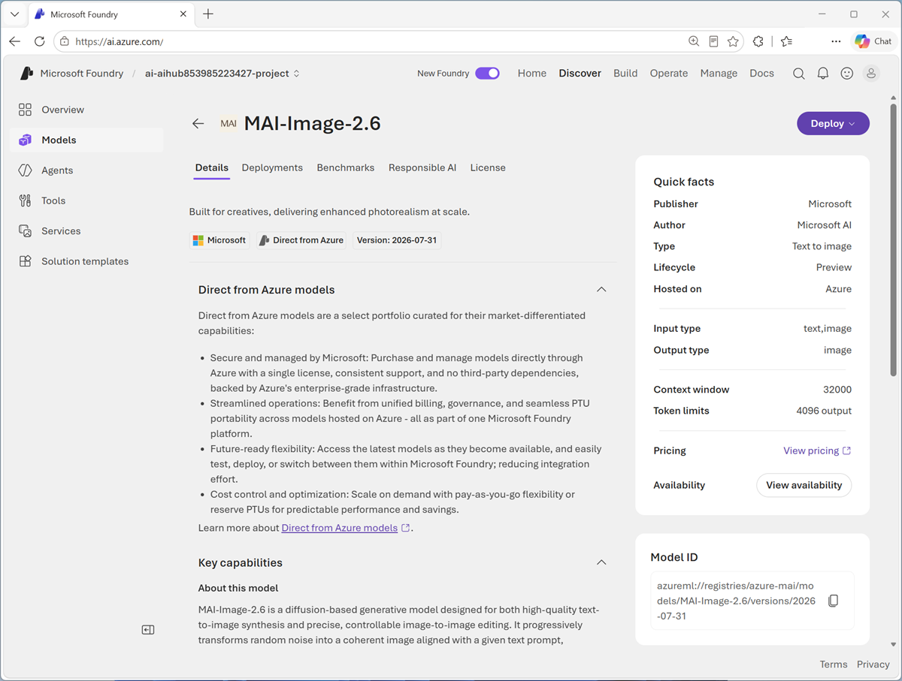

1. Use the **Deploy** button to deploy the model using the default settings. Deployment may take a minute or so.

    > **Tip**: If your project is in an unsupported region, you can deploy the model to a new project with a Foundry resource in a different region.

1. When the model has been deployed, view the model playground page that is opened, in which you can chat with the model.

    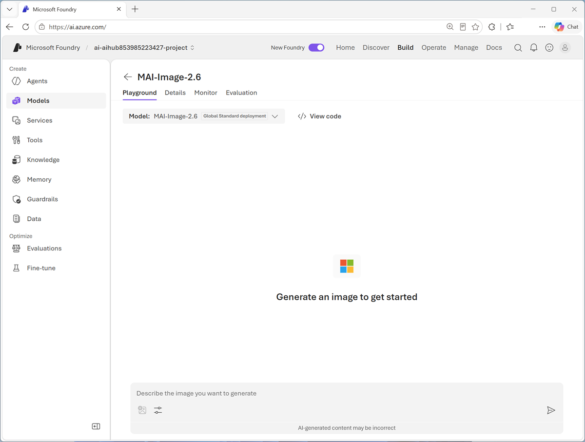

1. In the chat pane, enter the following prompt:

    ```
   A sleek, modern robot seated at a desk, using a 1980's personal computer with a keyboard and mouse.
    ```

1. Review the image that the model generates.

    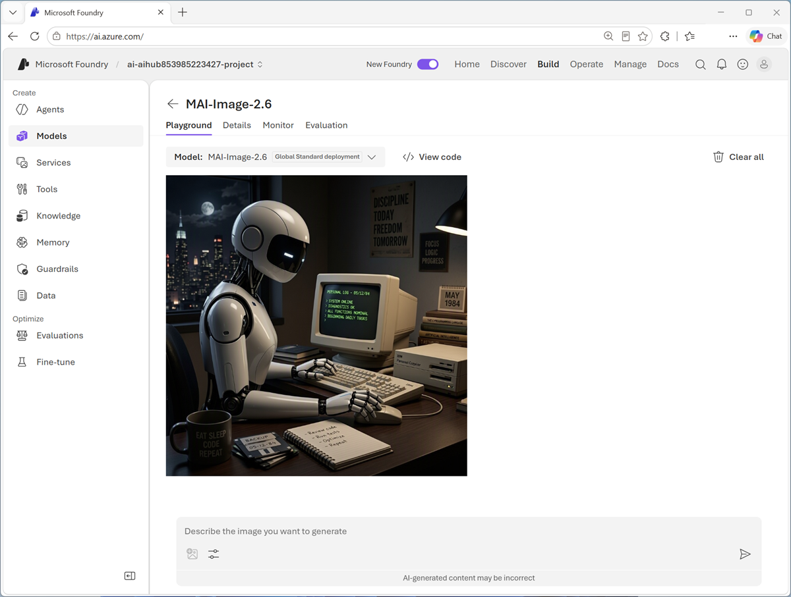

## Test an *MAI-Transcribe* model

Microsoft AI *MAI-Transcribe* is a family of text to speech models that you can use to generate text transcriptions from spoken audio.

1. In the Foundry portal, on the **Discover** page, select the **Models** page and search for `MAI-Transcribe`. Then select any of the available *MAI-Transcribe-x* models and view its information card.

    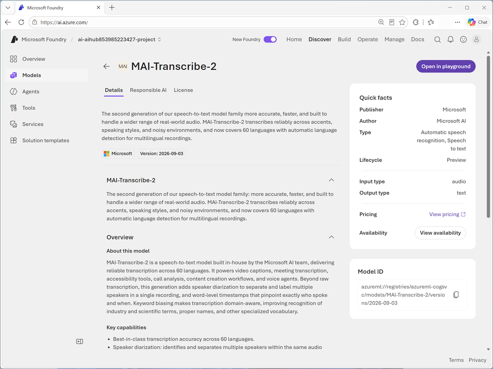

    MAI Transcribe models are provided through MIcrosoft Azure Speech in Foundry Tools; so you dont need to explicitly deploy the model.

1. Open the MAI-Transcribe model in the playground, which is used to test Azure Speech service functionality.

    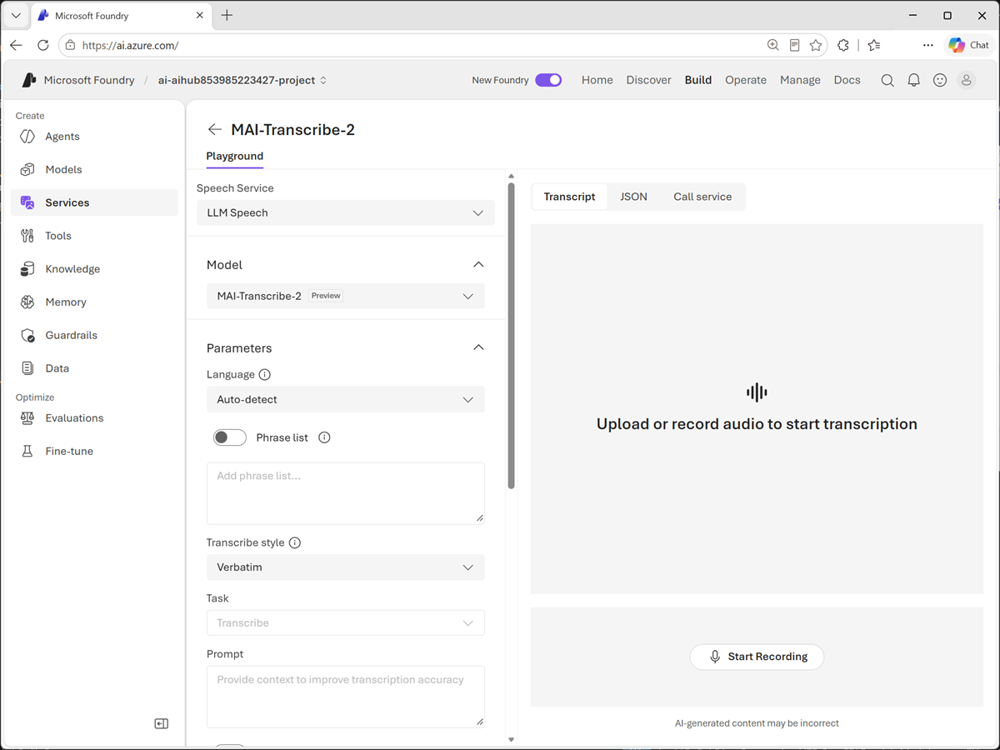

1. Select **Start recording** and then speak into your system microphone - try saying something like "*Open the pod bay doors.*"

1. Stop recording when you are finished, and view the transcription that is generated.

    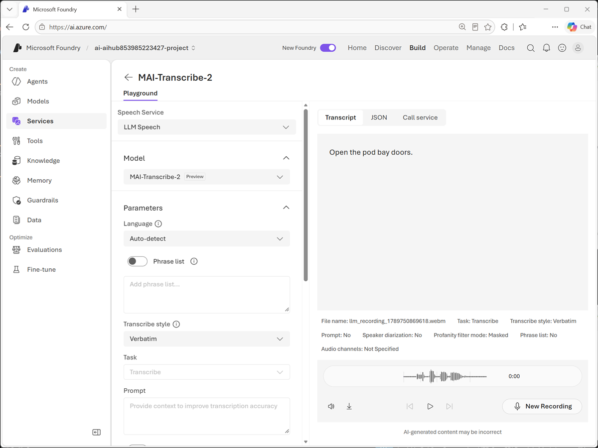

## Test an *MAI-Voice* model

Microsoft AI *MAI-Voice* is a family of speech to text models that you can use to synthesize audio speech from text.

1. In the Foundry portal, on the **Discover** page, select the **Models** page and search for `MAI-Voice`. Then select any of the available *MAI-Voice-x* models and view its information card.

    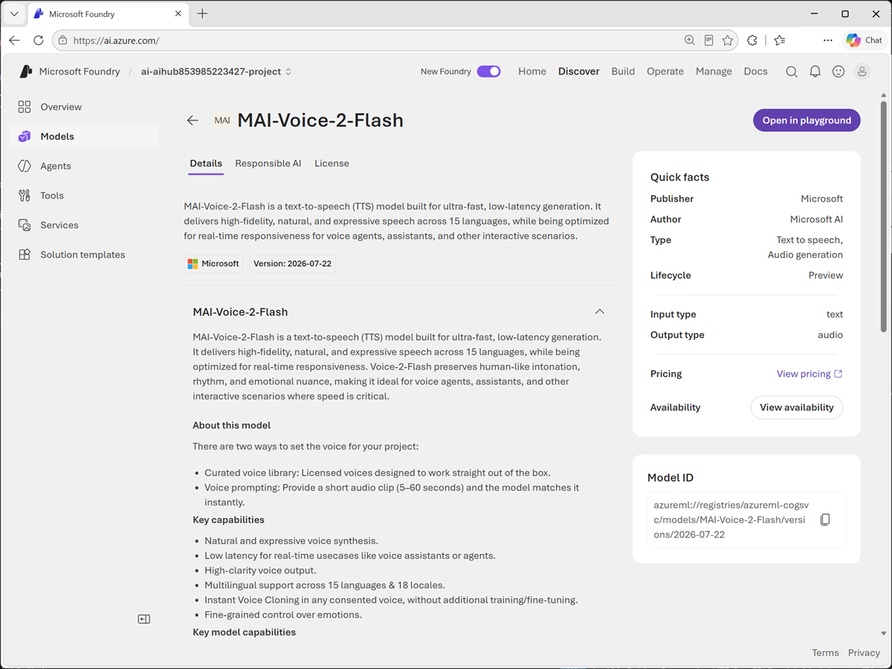

    MAI Voice models are provided through MIcrosoft Azure Speech in Foundry Tools; so you dont need to explicitly deploy the model.

1. Open the MAI-Voice model in the playground, which is used to test Azure Speech service functionality.

    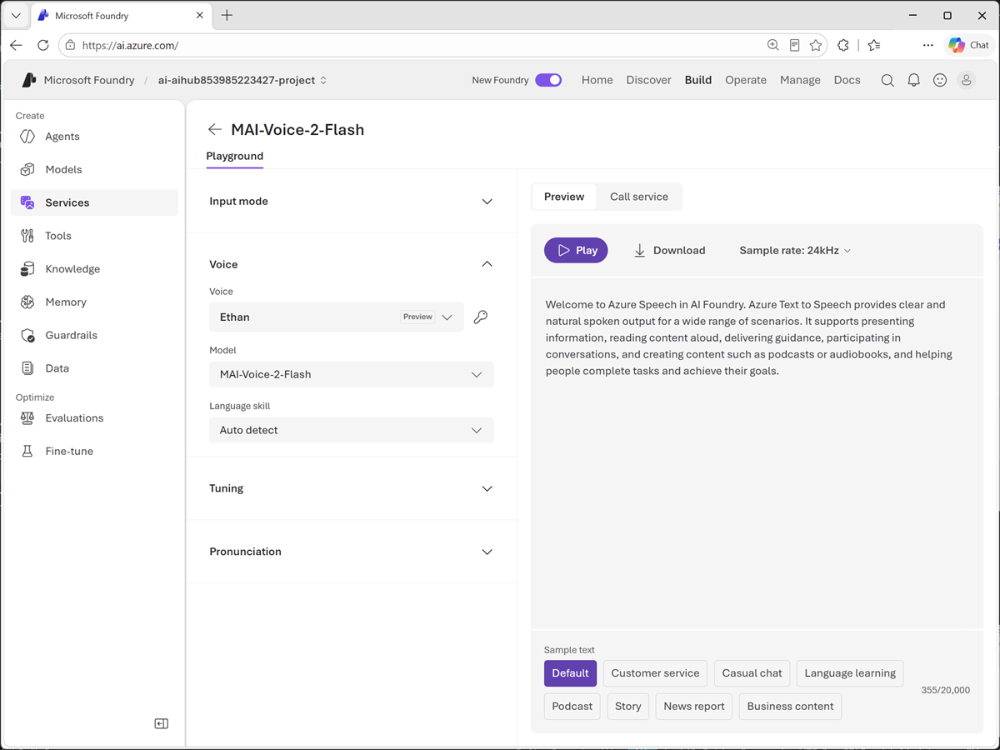

1. Change the default text to "*I'm sorry Dave. I'm afraid I can't do that!*" and select **Play**.

1. Listen to the speech that is synthesized.

    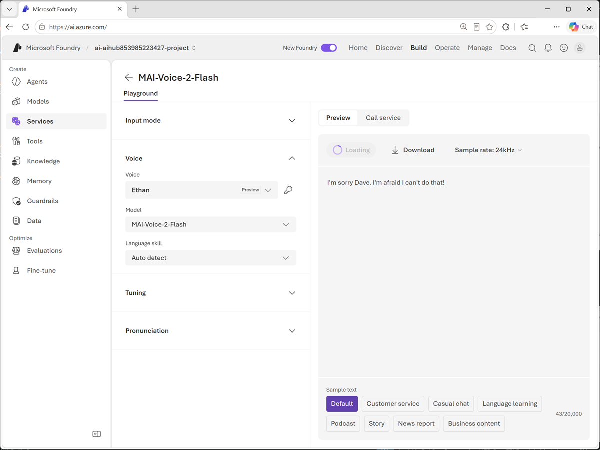

## Summary

In this exercise, you explored Microsoft AI models in Microsoft Foundry.

If you have finished exploring Microsoft Foundry, you should delete the Azure resources created in this lab to avoid unnecessary utilization charges.
