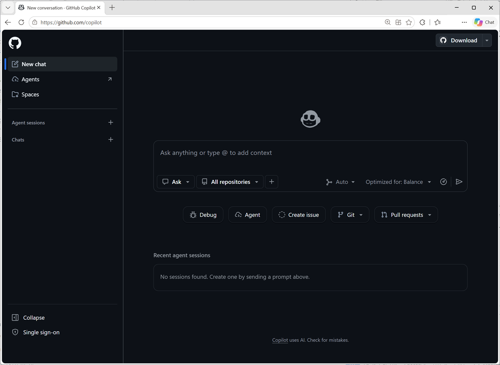
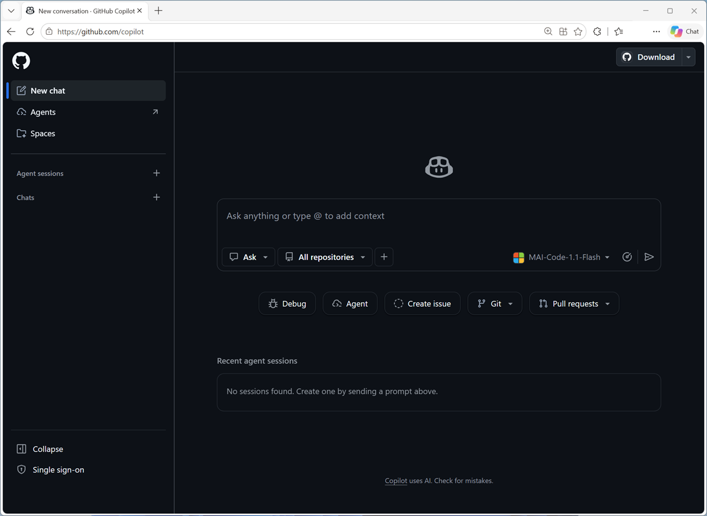
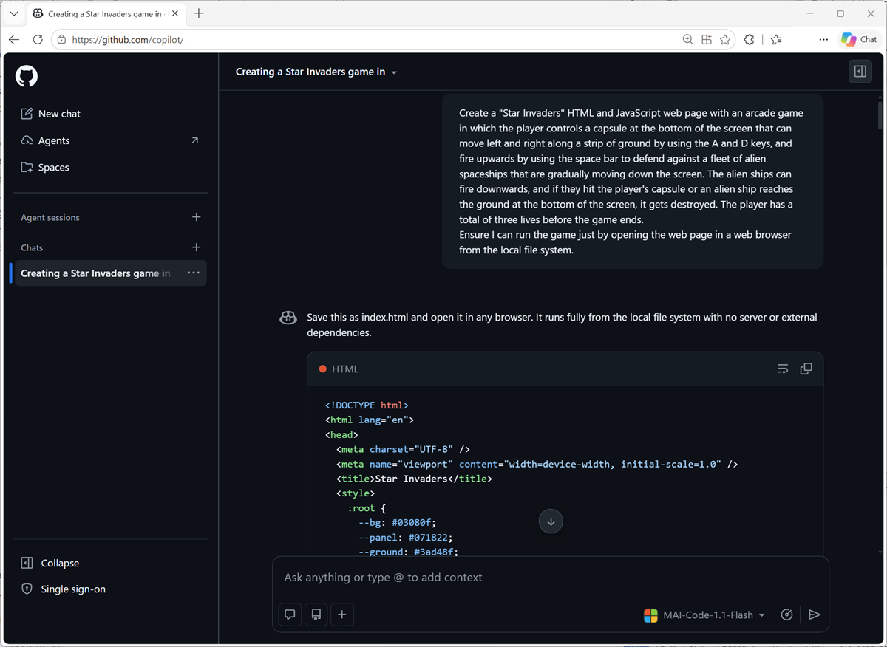
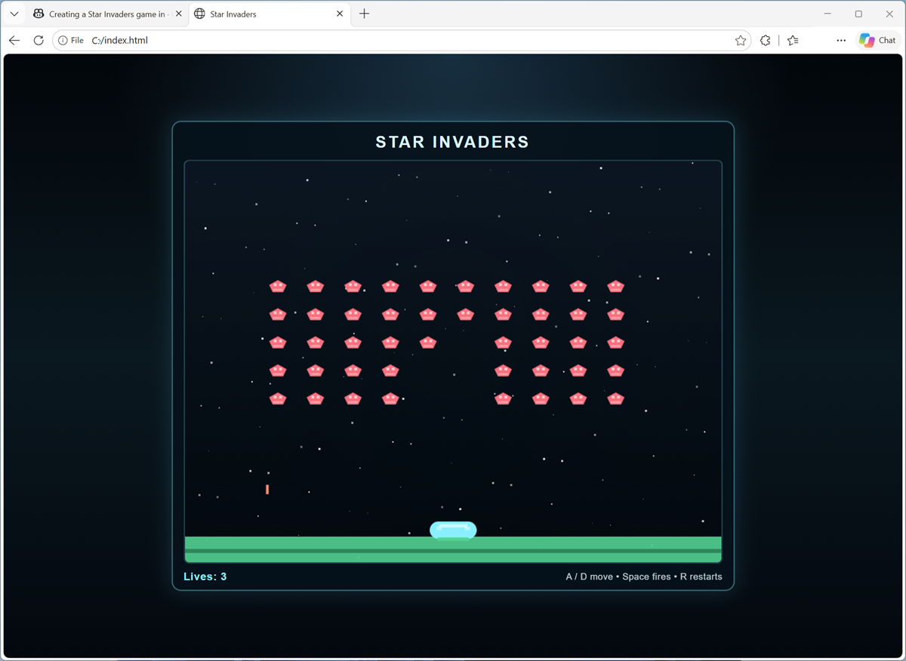

---
lab:
  title: Use a Microsoft AI Code model to generate an application
  description: Use an MAI Code model to generate code for an application.
  duration: 20 minutes
  level: 200
  islab: true
  status: released
  primarytopics:
    - Microsoft AI models
---

# Use a Microsoft AI Code model to generate an application

In this exercise, you'll use a Microsoft MAI Code model in GitHub Copilot to create a simple video game application.

This exercise should take approximately **20** minutes to complete.

> **Note**: This exercise requries a [GitHub Copilot Pro-tier or higher plan](https://github.com/features/copilot/plans){:target="_blank"}!

## Use an MAI Code model in GitHub Copilot

GitHub Copilot is an AI assistant that can generate code based on natural language descriptions of the applications and features you want to build.

1. In a web browser, sign into [GitHub Copilot](https://github.com/copilot){:target="_blank"} at `https://github.com/copilot` using your GitHub credentials (or sign up for a new account if you don't already have one).

    The GitHub Copilot site should look similar to this.

    

1. In the chat pane, change the selected model from **Auto** to the latest available **MAI-Code-*n.n*-Flash** model.

    

    **Note**: If you are using a free-tier GitHub Copilot account, you may be unable to select a specific model.

1. In the chat pane, enter the following prompt:

    ```prompt
    Create a "Star Invaders" HTML and JavaScript web page with an arcade game in which the player controls a capsule at the bottom of the screen that can move left and right along a strip of ground by using the A and D keys, and fire upwards by using the space bar to defend against a fleet of alien spaceships that are gradually moving down the screen. The alien ships can fire downwards, and if they hit the player's capsule or an alien ship reaches the ground at the bottom of the screen, it gets destroyed. The player has a total of three lives before the game ends.
    Ensure I can run the game just by opening the web page in a web browser from the local file system.
    ```

1. Wait while GitHub Copilot considers the prompt and generates the required code.

    

1. Copy the generated code. Then use a text editor or your preferred tool to create a new empty file named **index.html** anywhere in your local file system and paste the code into the new file.
1. Save the file and open it in a Web browser to test the application.

    

## Summary

In this exercise, you used a Microsoft AI Code model to generate application code in GitHub Copilot..
